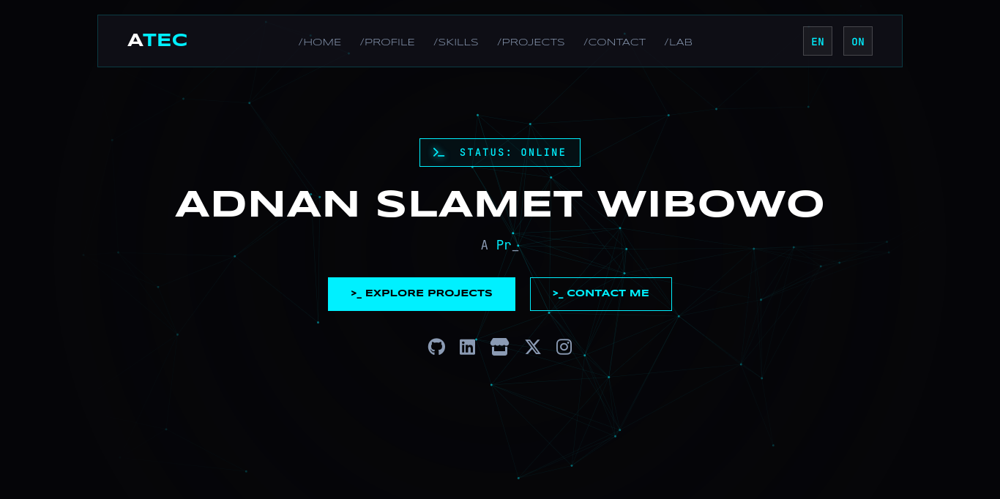

# Portofio Website

 
<p align="center">
  
  
  
  
</p>

## Overview

This repository contains the source code for my personal portfolio website. It is designed to showcase my projects, skills, and experience as a **Web Developer** and **Prompt Designer**.

The site is built with a focus on performance, interactivity, and a modern "Cyberpunk/Cyan" aesthetic. It features a bilingual system (Indonesian/English) managed via JSON.

**Live Demo:** [https://www.aadnanmt.web.id](https://www.aadnanmt.web.id)

## Key Features

* **Lightweight Backend:** Powered by Python **Flask**.
* **Multi-Language Support:** Dynamic switching between Indonesian and English using `static/lang/language.json`.
* **Interactive UI:** Custom Particle System implementation on HTML5 Canvas (`main.js`).
* **Responsive Design:** Fully optimized for Desktop, Tablet, and Mobile.
* **Security:** Implemented basic security headers via `flask-talisman` (commented out in dev, ready for prod).
* **Vercel Ready:** Configured for serverless deployment via `vercel.json`.

## Tech Stack

* **Backend:** Python 3.x, Flask
* **Frontend:** HTML5, CSS3, JavaScript
* **Assets:** FontAwesome 6, Google Fonts (Space Grotesk, Syncopate, JetBrains Mono)
* **Deployment:** Vercel Serverless

## Project Structure

```/
├── api/
│   └── app.py                  # Application entry point
├── static/
│   ├── css/
│   │   └── main.css            # Stylesheet
│   ├── img/
│   │   └── me.jpg              # Profile image
│   ├── js/
│   │   └── main.js             # Frontend logic
│   ├── lang/
│   │   └── language.json       # JSON file for English/Indonesian translations
│   ├── svg/
│   │   └── iconan.svg          # SVG Icon
│   └── note.txt                # Secret text file with credits and notes
├── templates/
│   └── main.html               # HTML template for the single-page site
├── LICENSE                     # MIT License file
├── README.md                   # Project documentation
├── requirements.txt            # Python dependencies (Flask, talisman, etc)
└── vercel.json                 # Vercel deployment configuration
```

## Installation & Local Development

1.  **Clone the repository**
    ```bash
    git clone https://github.com/aadnanmt/MySite-Portofolio.git
    cd MySite-Portofolio
    ```

2.  **Create a Virtual Environment on Windows**
    ```bash
    python -m venv venv
    venv\Scripts\activate
    ```
3.  **Create a Virtual Environment on macOS/Linux**
    ```bash
    python -m venv venv
    source venv/bin/activate
    ```

4.  **Install Dependencies**
    ```bash
    pip install -r requirements.txt
    ```

5.  **Run the Application**
    ```bash
    cd api
    flask run
    ```

6.  **Access the site**
    Open your browser and go to [http://127.0.0.1:5000](http://127.0.0.1:5000)

## License

This project is licensed under the **MIT License**. See the [LICENSE](LICENSE) file for details.

## Contact

* **Name:** Adnan Slamet Wibowo
* **Role:** Web Developer & Prompt Designer
* **Email:** aadnanmtcontact@gmail.com
* **LinkedIn:** [Adnan Slamet Wibowo](https://linkedin.com/in/adnan-slamet-wibowo-73906035b)

---
<p align="center">Made with ❤️ and ☕ in Indonesia</p>