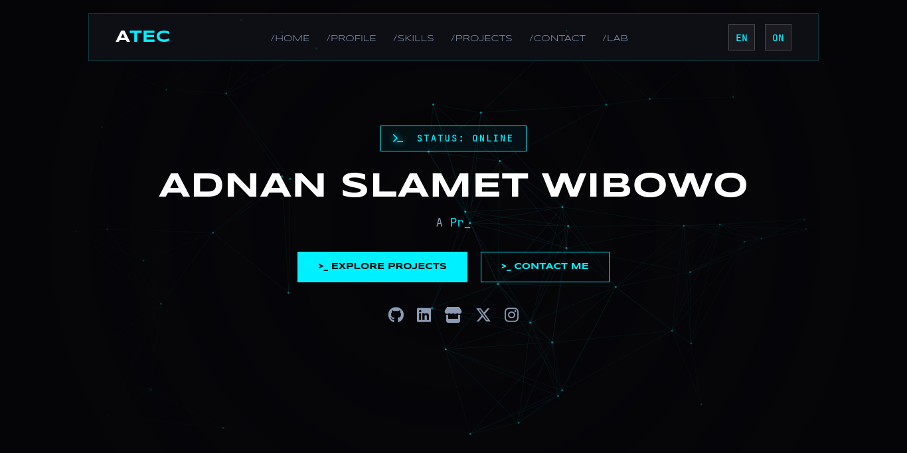

# Website Portofolio


<p align="center">
  
  
  
  
  
</p>

## Gambaran Umum

Repository ini berisi source code website portofolio pribadiku. Dibuat untuk menampilkan proyek, keahlian, dan pengalaman sebagai **Web Developer** dan **Prompt Designer**.

Website dibangun dengan fokus pada performa, interaktivitas, dan estetika modern bergaya *Cyberpunk/Cyan*. Dilengkapi sistem bilingual (Indonesia/Inggris) yang dikelola via JSON.

**Live Demo:** [https://www.aadnanmt.web.id](https://www.aadnanmt.web.id)

## Fitur Utama

- **Backend Ringan:** Python **Flask** sebagai server.
- **Multi-Bahasa:** Beralih antara Indonesia dan Inggris via `static/lang/language.json`.
- **UI Interaktif:** Particle System custom di HTML5 Canvas, efek typing, dan preloader.
- **Desain Responsif:** Optimal di Desktop, Tablet, dan Mobile.
- **SEO:** Meta tags lengkap, `robots.txt`, dan `sitemap.xml` dinamis.
- **Security Headers:** Cache control, X-Frame-Options, X-Content-Type-Options.
- **Vercel Ready:** Konfigurasi serverless via `vercel.json`.

## Tech Stack

- **Backend:** Python 3.x, Flask, Flask-Minify
- **Frontend:** HTML5, SCSS (dikompilasi via libsass), Vanilla JavaScript (ES Modules)
- **Assets:** FontAwesome 6, Google Fonts (Space Grotesk, Syncopate, JetBrains Mono)
- **Deployment:** Vercel Serverless

## Struktur Proyek

```
MySite-Portofolio/
├── app.py                      # Entry point aplikasi Flask
├── build.py                    # Script compile SCSS --> CSS
├── requirements.txt            # Python dependencies
├── vercel.json                 # Konfigurasi deployment Vercel
├── backend/
│   ├── routes/
│   │   ├── home.py             # Route halaman utama (/)
│   │   ├── blog.py             # Route blog (/blog/)
│   │   └── seo.py              # Route robots.txt & sitemap.xml
│   ├── security/
│   │   └── headers.py          # Security & cache headers
│   └── utility/
│       └── util.py             # Helper: baca & cache posts markdown
├── frontend/
│   ├── js/                     # Source JavaScript (ES Modules)
│   │   ├── main.js
│   │   └── module/             # language, navigation, particle, dll
│   └── scss/                   # Source SCSS modular
│       ├── main.scss
│       ├── abstracts/          # Variables, mixins, utils
│       ├── base/               # Reset, typography, global
│       ├── components/         # Header, hero, content, footer
│       └── pages/              # Blog index & blog post
├── static/
│   ├── css/
│   │   ├── main.css            # CSS hasil compile dari SCSS
│   │   ├── all.css             # FontAwesome
│   │   └── syntax.css          # Syntax highlighting (Pygments)
│   ├── js/                     # JavaScript siap di-serve
│   │   ├── main.js
│   │   └── module/
│   ├── fonts/                  # Web fonts
│   ├── img/                    # Gambar profil
│   ├── lang/
│   │   └── language.json       # Data terjemahan ID/EN
│   └── svg/
│       └── iconan.svg          # Icon website
├── templates/
│   ├── layouts/
│   │   └── base.html           # Layout utama Jinja2
│   ├── components/             # Navbar, hero, about, skills, dll
│   └── pages/                  # home, blog, error 404
└── posts/                      # Artikel blog format Markdown
```

## Instalasi & Development Lokal

**1. Clone repository**
```bash
git clone https://github.com/aadnanmt/MySite-Portofolio.git
cd MySite-Portofolio
```

**2. Buat virtual environment**
```bash
# macOS / Linux
python -m venv venv
source venv/bin/activate

# Windows
python -m venv venv
venv\Scripts\activate
```

**3. Install dependencies**
```bash
pip install -r requirements.txt
```

**4. Jalankan aplikasi**
```bash
flask run
```

**5. Akses di browser**
Buka [http://127.0.0.1:5000](http://127.0.0.1:5000)

---

### Update CSS (setelah ubah SCSS)

```bash
python build.py
```

### Tambah artikel blog baru

Buat file `.md` baru di folder `posts/` dengan format frontmatter berikut:

```markdown
---
title: "Judul Artikel"
date: "YYYY-MM-DD"
description: "Deskripsi singkat artikel."
tags: ["tag1", "tag2"]
---

Isi artikel di sini...
```

## Lisensi

Proyek ini dilisensikan di bawah **MIT License**. Lihat file [LICENSE](LICENSE) untuk detail.

## Kontak

- **Nama:** Adnan Slamet Wibowo
- **Role:** Web Developer & Prompt Eng.
- **Email:** contact@aadnanmt.web.id
- **Instagram:** [@aadnanmt](https://www.instagram.com/aadnanmt)

---
<p align="center">Dibuat oleh Adnan dari Indonesia</p>